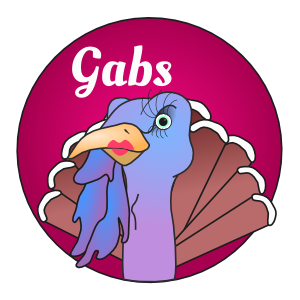

Gabs is a small utility for dealing with dynamic or unknown JSON structures in golang. It's pretty much just a helpful wrapper around the golang json.Marshal/json.Unmarshal behaviour and map[string]interface{} objects. It does nothing spectacular except for being fabulous.

https://godoc.org/github.com/Jeffail/gabs

##How to install:

```bash
go get github.com/jeffail/gabs
```

##How to use

###Parsing and searching JSON

```go
...

import "github.com/jeffail/gabs"

jsonParsed, err := gabs.ParseJSON([]byte(`{
	"outter":{
		"inner":{
			"value1":10,
			"value2":22
		},
		"alsoInner":{
			"value1":20
		}
	}
}`))

var value float64
var ok bool

value, ok = jsonParsed.Path("outter.inner.value1").Data().(float64)
// value == 10.0, ok == true

value, ok = jsonParsed.Search("outter", "inner", "value1").Data().(float64)
// value == 10.0, ok == true

value, ok = jsonParsed.Path("does.not.exist").Data().(float64)
// value == 0.0, ok == false

...
```

###Iterating arrays

```go
...

jsonParsed, _ := gabs.ParseJSON([]byte(`{"array":[ "first", "second", "third" ]}`))

// S is shorthand for Search
children, _ := jsonParsed.S("array").Children()
for _, child := range children {
	fmt.Println(child.Data().(string))
}

...
```

Will print:

```
first
second
third
```

Children() will return all children of an array in order. This also works on objects, however, the children will be returned in a random order.

###Searching through arrays

If your JSON structure contains arrays you can still search the fields of the objects within the array, this returns a JSON array containing the results for each element.

```go
...

jsonParsed, _ := gabs.ParseJSON([]byte(`{"array":[ {"value":1}, {"value":2}, {"value":3} ]}`))
fmt.Println(jsonParsed.Path("array.value").String())

...
```

Will print:

```
[1,2,3]
```

###Generating JSON

```go
...

jsonObj := gabs.New()
// or gabs.Consume(jsonObject) to work on an existing map[string]interface{}

jsonObj.Set(10, "outter", "inner", "value")
jsonObj.SetP(20, "outter.inner.value2")
jsonObj.Set(30, "outter", "inner2", "value3")

fmt.Println(jsonObj.String())

...
```

Will print:

```
{"outter":{"inner":{"value":10,"value2":20},"inner2":{"value3":30}}}
```

To pretty-print:

```go
...

fmt.Println(jsonObj.StringIndent("", "  "))

...
```

Will print:

```
{
  "outter": {
    "inner": {
      "value": 10,
      "value2": 20
    },
    "inner2": {
      "value3": 30
    }
  }
}
```

###Generating Arrays

```go
...

jsonObj := gabs.New()

jsonObj.Array("foo", "array")
// Or .ArrayP("foo.array")

jsonObj.ArrayAppend(10, "foo", "array")
jsonObj.ArrayAppend(20, "foo", "array")
jsonObj.ArrayAppend(30, "foo", "array")

fmt.Println(jsonObj.String())

...
```

Will print:

```
{"foo":{"array":[10,20,30]}}
```

###Converting back to JSON

This is the easiest part:

```go
...

jsonParsedObj := gabs.ParseJSON([]byte(`{
	"outter":{
		"values":{
			"first":10,
			"second":11
		}
	},
	"outter2":"hello world"
}`))

jsonOutput := jsonParsedObj.String()
// Becomes `{"outter":{"values":{"first":10,"second":11}},"outter2":"hello world"}`

...
```

And to serialize a specific segment is as simple as:

```go
...

jsonParsedObj := gabs.ParseJSON([]byte(`{
	"outter":{
		"values":{
			"first":10,
			"second":11
		}
	},
	"outter2":"hello world"
}`))

jsonOutput := jsonParsedObj.Search("outter").String()
// Becomes `{"values":{"first":10,"second":11}}`

...
```
